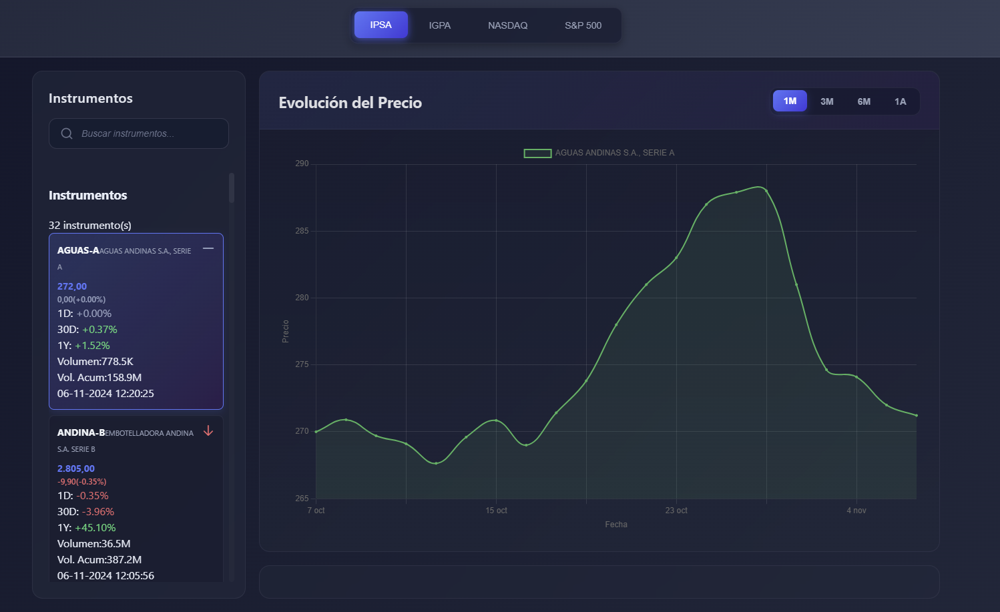
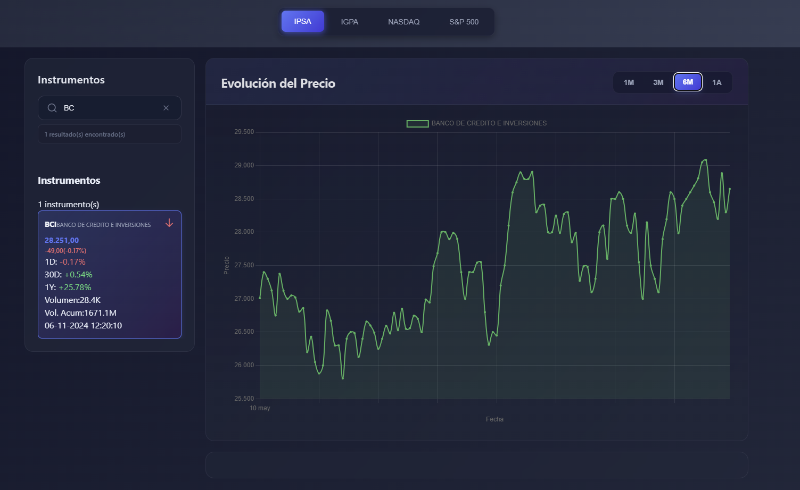

# 📈 Dashboard Financiero - Prueba Técnica

<div align="center">
  
  
  
</div>

## 📸 Vista Previa del Proyecto

<div align="center">
  
  <p><em>Dashboard principal con vista completa de instrumentos y gráficos</em></p>
</div>

<div align="center">
  
  <p><em>Interacción al seleccionar diferentes instrumentos</em></p>
</div>

<div align="center">
  
  <p><em>Busqueda en Search-Bar Component</em></p>
</div>


## 🚀 Inicio Rápido

```bash
npm install
ng serve
# Abrir http://localhost:4200
```

## 📦 Componentes Implementados

| Componente | Funcionalidad |
|------------|---------------|
| 🔍 **SearchBarComponent** | Búsqueda y filtrado de instrumentos |
| 📋 **HeaderComponent** | Información del índice IPSA con variaciones |
| 📊 **ChartComponent** | Gráfico con períodos (1M, 3M, 6M, 1A) |
| 🔄 **TabComponent** | Navegación entre índices (IPSA, IGPA, NASDAQ, S&P 500) |
| 📄 **SummaryComponent** | Detalle de cotización del instrumento seleccionado |
| 📜 **InstrumentListComponent** | Lista de instrumentos del mercado |
| 🎯 **InstrumentItemComponent** | Item individual interactivo |

## 🔧 Tecnologías Utilizadas

### 🎯 Frontend
- **Angular 19.2.7** - Framework principal
- **TypeScript 5.0+** - Lenguaje de programación
- **Angular Signals** - Gestión de estado reactivo
- **SCSS** - Estilos avanzados
- **Chart.js** - Gráficos interactivos


---

## 📁 Estructura del Proyecto

```
src/
├── 📂 app/
│   ├── 📂 components/          # Componentes de la aplicación
│   │   ├── 🔍 search-bar/     # Barra de búsqueda
│   │   ├── 📋 header/         # Cabecera con información del índice
│   │   ├── 📊 chart/          # Gráfico interactivo
│   │   ├── 🔄 tab/            # Pestañas de navegación
│   │   ├── 📄 summary/        # Resumen de cotización
│   │   ├── 📜 instrument-list/ # Lista de instrumentos
│   │   └── 🎯 instrument-item/ # Item individual
│   ├── 📂 services/           # Servicios de la aplicación
│   │   ├── 🔄 app-state.service.ts    # Estado global
│   │   └── 📡 data.service.ts         # Comunicación HTTP
│   ├── 📂 models/             # Modelos de datos
│   └── 📂 files/              # Archivos JSON de datos
└── 📂 assets/                 # Recursos estáticos
```

---

## 🌟 Características Avanzadas


### 🔄 **Actualización Reactiva**
- Cambios automáticos en todos los componentes
- Sincronización en tiempo real
- Performance optimizada

### 🎨 **Diseño Moderno**
- Gradientes dinámicos
- Efectos de hover suaves
- Tema oscuro profesional
- Iconografía consistente

---

## 📈 Funcionalidades

### 🔍 **Búsqueda Avanzada**
- Filtrado por nombre del instrumento
- Búsqueda por código (ej: AGUAS-A, BCI)
- Autocompletado inteligente
- Selección automática con Enter

### 📊 **Visualización de Datos**
- Gráficos de líneas interactivos
- Múltiples períodos de tiempo
- Zoom y pan en gráficos
- Tooltips informativos

### 🔄 **Navegación de Índices**
- IPSA (Índice de Precios Selectivo de Acciones)
- IGPA (Índice General de Precios de Acciones)
- NASDAQ
- S&P 500

